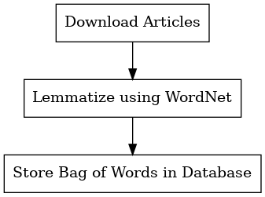
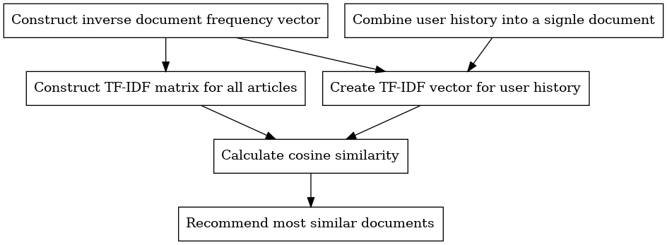
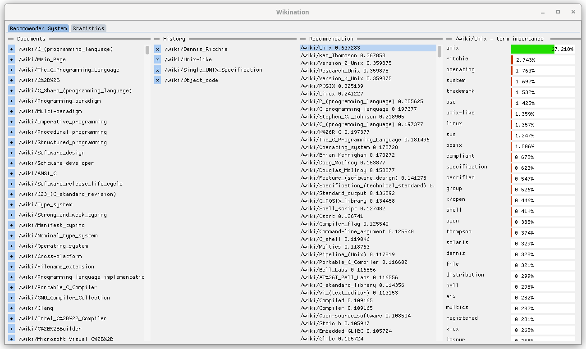
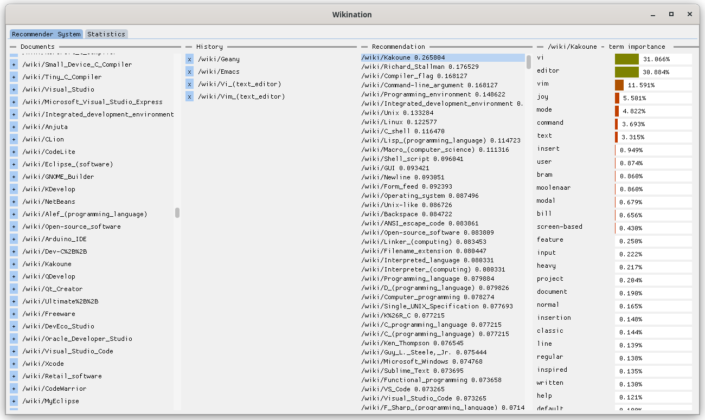
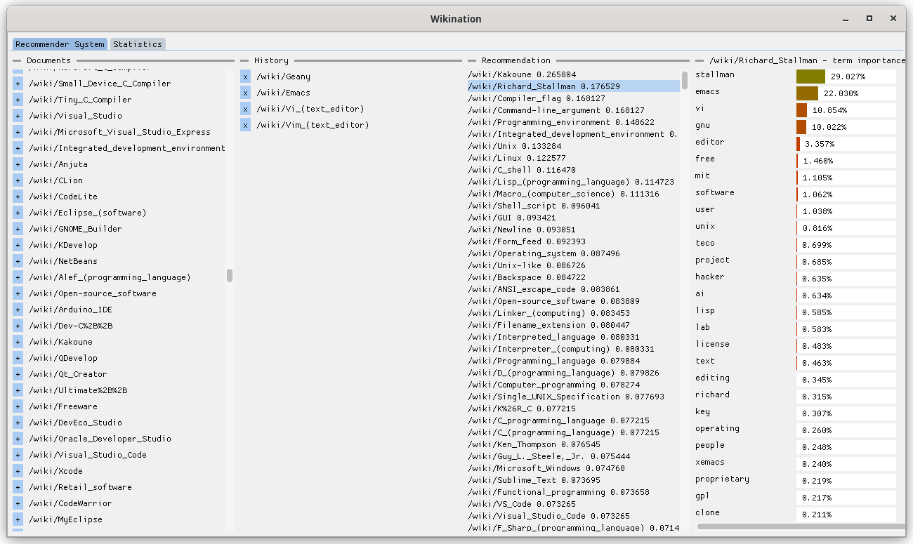
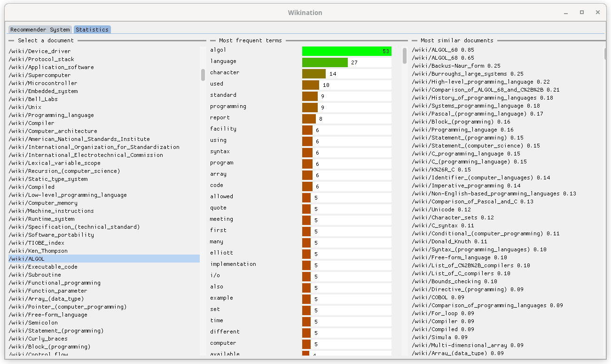

% Wikination - Wikipedia Recommender System
% Maciej Janicki, Jakub Kubiak
% December 28, 2024

Wikination is wikipedia article recommendation system.

## Algorithm

Wikination system consists of two programs - crawler and wikination itself.

### Crawler

Crawler is responsible for crawling the Wikipedia, downloading articles and creating their bag of words representation and storing results in a database.

#### Downloading articles

Given a start article, by default about C programming language, crawler scans the page looking for links to other articles and explores them using breadth-first search.

#### Extracting paragraphs

Crawler first removes all references superscript then extracts all `p` tags from HTML documents.
Wikipedia only stores article text in `p` tags so that way we can avoid processing website's UI.
Processing only `p` tags has some disadvantages that we are aware of.
First of all, not all of the articles' content is tagged with `p`.
Some articles have tables or lists, the crawler does not take them into account when creating the bag of words.
From testing we were able to deduce that most of the data stored in tables and lists are references to sources or other articles, without any simple way to filter them out.
In terms of the recommendation system they are not useful - most of the article occur in the first paragraph defining the article topic.

#### Tokenisation

Tokenisation is performed using `nltk` library.

#### Stop words removal 

From the list of tokens we remove any English stop words, punctuation marks, single letter words (excluding programming languages names) and numbers other than dates.

#### Lemmatization

Remaining tokens are lemmatized using `WordNetLemmatizer` provided by `nltk`, using `noun` part of speech tag.

#### Bag of words creation and storage

Lemmatized tokens are then used to created bag of words representation of each documents.
The representation is then stored in `sqlite3` database.

##### Database schema

`words` table:

|word_id|word|frequency|
|------|---|---|
|id|actual term content| how many documents contain the term|

`documents` table

|document_id|doc_name|doc_text|
|------|---|---|
|id|document name (e.g. `/wiki/ALGOL`)| raw html document contents|

`bag_of_words` table

|document_id|word_id|frequency|
|---|---|---|
|foreign key|foreign key|how many times a given term occurs in a given document|

### wikination

Wikination is a GUI that interacts with the database and allows user to receive article recommendations based on a user history.

#### IDF vector construction

Inverse document frequency vector is constructed based on document frequency vector present in the database.

#### Article TF-IDF matrix construction

First, article bag of words representation present in the database is transformed in to term frequency, then each term frequency is multiplied by its inverse-document frequency.

#### User history document

Documents present in user's history are combined into a single large document (their bag of words are summed).
We then transform that into TF-IDF vector.
That way we represent user history as a single vector.

#### Cosine Similarity

For each article we calculate its similarity similarity to user history using cosine similarity.

#### Recommend most similar documents

We sort each article according to their similarity.

User can also read the recommendation breakdown after clicking on one of the articles.
The prediction breakdown shows percentage of how much each term contributes to final document score (similarity).
It is calculated by dividing product TF-IDF of a given term by dot product of the user history document and the selected document.

## Recommendation analysis

### Example 1

If we look at first recommendation example we can see that user looked through 4 articles: Dennis Ritchie, Unix-like, Single UNIX specification, Object code.
The most recommended article is Unix with similarity of `0.64`.
The recommendation is justified by term importance histogram, the most contributing term to the recommendation is word `unix`, which is quite understandable.

The second recommended article is about Ken Thompson.
The terms crucial for recommending the article are: `unix` (Ken Thompson is one of the creators of UNIX), `thompson` and `ritchie`.

### Example 2

If we look at second recommendation example we can see that user looked through 4 articles: Geany, Emacs, Vi, VIM.
The most recommended article is Kakoun (terminal based text editor) with similarity `0.27`.
The most important terms were `vi` and `editor`.

The second recommended artilce is about Richard Stallman, GNU creator, FSF founder and EMACS creator so it makes sense that second most important term for recommendation is `emacs`.

## Article database analysis

Wikination provides convenient way to analyse documents present in the database.
As an example let's look at the analysis of ALGOL article.

The most frequent term in the article is `algol`, the most similar articles are `ALGOL_60` and `ALGOL_68`.
