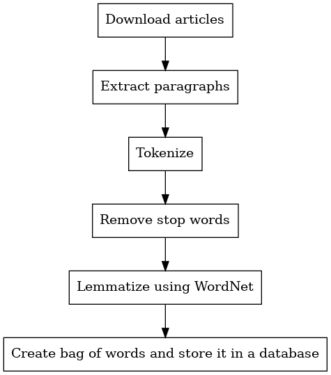

# Wikination - Wikipedia Recommender System

Wikination is wikipedia article recommendation system.

## Algorithm

Wikination system consists of two programs - crawler and wikination itself.

### Crawler

Crawler is responsible for crawling the Wikipedia, downloading articles and creating their bag of words representation and storing results in a database.

#### Downloading articles

Given a start article, by default about [C programming language](https://en.wikipedia.org/wiki/C_(programming_language), crawler scans the page looking for links to other articles and explores them using breadth-first search.

#### Extracting paragraphs

Crawler first removes all references superscript then extracts all `p` tags from HTML documents.
Wikipedia only stores article text in `p` tags so that way we can avoid processing website's UI.
Processing only `p` tags has some disadvantages that we are aware of.
First of all, not all of the articles' content is tagged with `p`.
Some articles have tables or lists, the crawler does not take them into account when creating the bag of words.
From testing we were able to deduce that most of the data stored in tables and lists are references to sources or other articles, without any simple way to filter them out.
In terms of the recommendation system they are not useful - most of the article occur in the first paragraph defining the article topic.

#### Tokenisation

Tokenisation is performed using `nltk` library.

#### Stop words removal 

From the list of tokens we remove any English stop words, punctuation marks, single letter words (excluding programming languages names) and numbers other than dates.

#### Lemmatization

Remaining tokens are lemmatized using `WordNetLemmatizer` provided by `nltk`, using `noun` part of speech tag.

#### Bag of words creation and storage

Lemmatized tokens are then used to created bag of words representation of each documents.
The representation is then stored in `sqlite3` database.

##### Database schema

###### `words` table

|word_id|word|frequency|
|------|---|---|
|id|actual term content| how many documents contain the term|

###### `documents` table

|document_id|doc_name|doc_text|
|------|---|---|
|id|document name (e.g. `/wiki/ALGOL`)| raw html document contents|

##### `bag_of_words` table

|document_id|word_id|frequency|
|---|---|---|
|foreign key|foreign key|how many times given term occurs in a given document|

